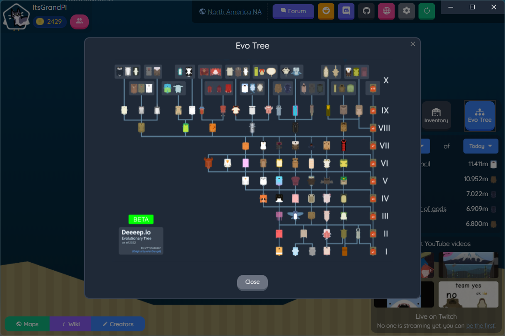
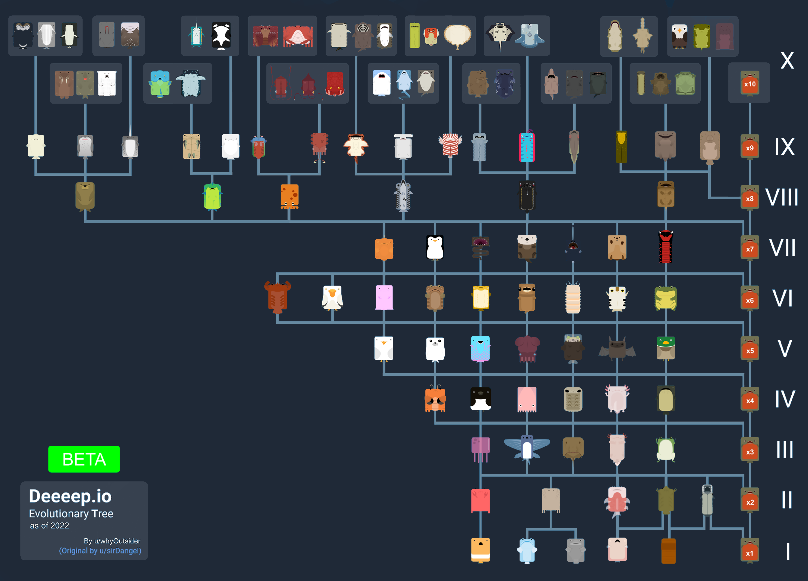
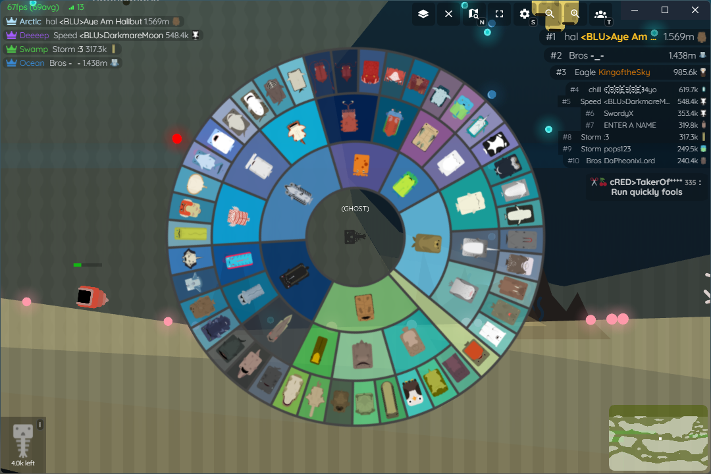
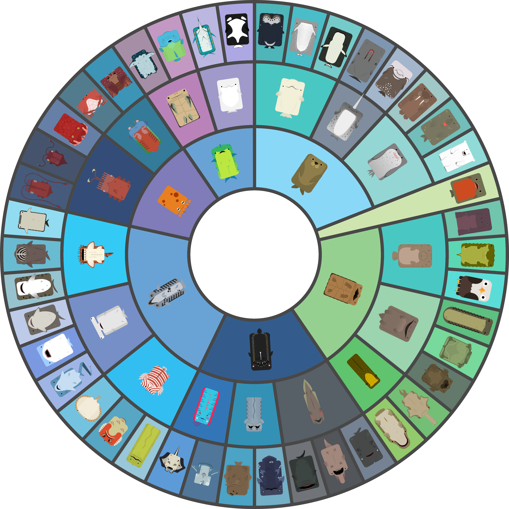

# Built-in Evolution Tree
Blockyfish Client has two built in evolution trees for you in case you forget the evolution path for a certain animal. 

## Menu Evolution Tree
The main menu has a button on the right for viewing the classic tree-styled evolution tree. 
-
-

## In-game Evolution Tree
The evolution tree can be accessed by holding down `Y` while playing. The wheel design is inspired by Diep.io. 
- 
-

### Download
You can download the evolution wheel as a `.psd` and `.ai` file here. 
[!file Adobe Illustrator 2022 file](../static/evotree/evo_circle.ai)[!file Adobe Photoshop 2022 file](../static/evotree/evo_circle.psd)