# Built-in Hacks
Blockyfish Client comes with automatic hack script injection so you don't have to worry about any of these complicated breakpoint stuff. Simply download and install the client and you're good to go. 

# Manual hack scripts
These scripts are for people who cannot use the Blockyfish Client for any reasons. They can be run from any browser that has DevTools. 
!!! Android
For Android users, you can also use some of these hacks. Look for the [!badge variant="info" text="Android"] badge to see which scripts has been tested. 
To use DevTools on Android, install [Kiwi Browser](https://kiwibrowser.com/). 
!!!

## Enabling Commands!
:::left-img
1. Go to [beta.deeeep.io](https://beta.deeeep.io)  

2. Open DevTools (yes that's what it's called) by using ctrl/cmd + shift + I (that's an i not an L)  

3. At the top, go to the sources tab  
-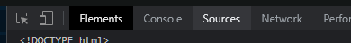  
 
4. Find the index.js file in beta.deeeep.io/assets/index.xxxxx.js  
-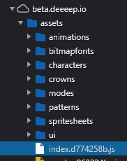  

5. Look towards the bottom and click the pretty-print button  
-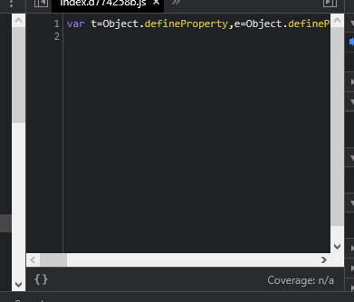  
-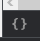  
!!!info Note
Now you will see around 50000 lines of code, don't be scared  
!!!

6. Use the "find" function (ctrl/cmd + F) and find "constructor"  
-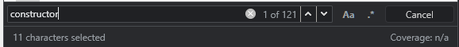  

7. Go to the very last one, 121/121. If there are more than 121, go to the last one, don't go to the 121st one.  
-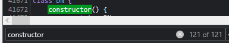  


8. Now click on any one of these line numbers. You can pick any line as long as they are within the constructor.   
-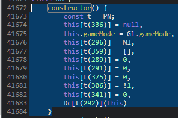  
-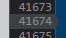  

9. Now you will see this. It may look a bit different depending on the line you clicked on. But the line number should turn blue.  
-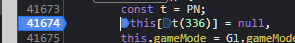  

10. If you look to the right, you will see that this new interesting thing that makes no sense has appeared  
-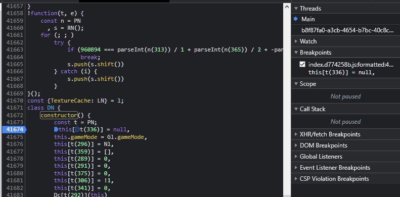  
-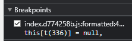  

## Getting the Commands to Work!
11. Now that you have the breakpoint thing added, press the play button. Yes, the depio play button. Do not touch random things in DevTools.  
-
12. Now it will get stuck here with a message saying "Pause in debugger"  
-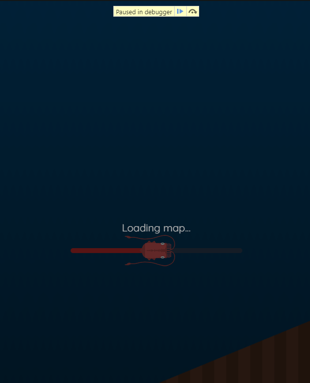
13. In DevTools, go to the Console tab  
-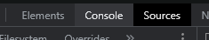
14. Put this in the console:
!!!warning Important
When changing gamemodes or loading a new map (e.g. PD/1v1), you need to run `window.game = this` again when you get to the debugger pause
!!!
```
window.game = this
```
15. You will get a response ~~it will deez nutz you~~  
-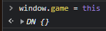
16. Press the unpause button in the debug thing that popped-up in step 12. Note that it's the blue button, I REPEAT THE BLUE BUTTON!  
-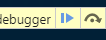
17. Now there will be 2 outcomes:  
  a. It shows the evo menu, in this case, proceed on to step 18  
  b. It returns you to the menu page. Press play again. This time, simply unpause the debugger. DO NOT PASTE THE COMMAND IN STEP 14 INTO THE CONSOLE AGAIN!
18. Choose an animal *\*duh\**  
-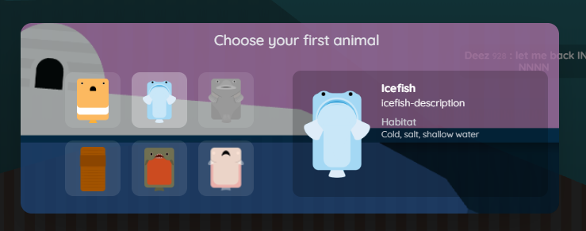

## Different hack scripts
19. There are various hacks you can use, I will list them below. Paste these commands into the console (the thing you used in step 14)
### **Transparent terrain**
[!badge variant="info" text="Android"]
#### **Ground:**
```
setInterval(function () {
for (let i = 0; i < game.currentScene.terrainManager.terrains.length; i++) {
    game.currentScene.terrainManager.terrains[i].alpha = 0.5;
}
}, 10);
```
#### **Ceiling (the thing that turns transparent when you go through them)**
```
setInterval(function () {
game.currentScene.ceilingsContainer.alpha = 0.3
}, 10);
```
### **Infinite zoom**
[!badge variant="info" text="Android"]
```
setInterval(function () {
game.viewport.clampZoom({
    minWidth: 0,
    maxWidth: 1e7,
})
}, 10);
```
### **Anti-ink and anti-darkness (in deep)**
[!badge variant="info" text="Android"]
```
game.currentScene.terrainManager.shadow.setShadowSize(1000000)
game.currentScene.terrainManager.shadow.setShadowSize = function() {}
```
### **Anti-megamouth (no more flash-bangs)**
[!badge variant="info" text="Android"]
```
game.currentScene.toggleFlash = function() {}
```
### **Visible hiding animals (buggy)**
[!badge variant="info" text="Android"]
```
setInterval(function () {
game.currentScene.myAnimal.handleHide = (function(){
game.currentScene.myAnimal.inner.alpha = 0.6
game.currentScene.myAnimal.sprite.scale.x = game.currentScene.myAnimal.origScale.x * 0.7
game.currentScene.myAnimal.sprite.scale.y = game.currentScene.myAnimal.origScale.y * 0.7
})
for (let i = 0; i < game.currentScene.entityManager.animalsList.length; i++) {
game.currentScene.entityManager.animalsList[i].handleHide = (function(){
game.currentScene.entityManager.animalsList[i].inner.alpha = 0.6
game.currentScene.entityManager.animalsList[i].sprite.scale.x = game.currentScene.entityManager.animalsList[i].origScale.x * 0.7
game.currentScene.entityManager.animalsList[i].sprite.scale.y = game.currentScene.entityManager.animalsList[i].origScale.y * 0.7
})
}
}, 10);
```

### **Names and animals always on top**
```
game.currentScene.namesLayer.zOrder = 998
game.currentScene.animalsContainer.zOrder = 999
```

### **Boost hacks**
Thresher, Beluga, and Beaked Whale has control + shift + click

Walking animals can control + shift + click to jump really high while walking

Every animal with a charged boost can control + click to use the charge boost ability instantly

Walking animals can alt + click to get off the ground
```
var ctrl_overlay = document.createElement('div')
document.querySelector('div.game').insertBefore(ctrl_overlay, document.querySelector('div.game').children[0])
ctrl_overlay.outerHTML = '<div id="ctrl-overlay" style="width: 100%;height: 100%;position: absolute;display: block;z-index:10000;pointer-events:none;"></div>'
function showCtrlOverlay(e) {
    if (e.ctrlKey || e.metaKey || e.altKey) {
        if (game.currentScene.myAnimal._visibleFishLevel != 101) {
            document.getElementById('ctrl-overlay').style.pointerEvents = 'all'
        }
        else if (!e.shiftKey) {
            if (game.currentScene.myAnimal._visibleFishLevel == 101)
            document.getElementById('ctrl-overlay').style.pointerEvents = 'all'
        }
        else {
            document.getElementById('ctrl-overlay').style.pointerEvents = 'none'
        }
    }
}
async function superShot() {
    game.inputManager.handleLongPress(1)
    setTimeout(() => {
        game.inputManager.handleLongPress(5000)
    }, 50)
    setTimeout(() => {
        game.inputManager.handleLongPress(5000)
    }, 100)
    setTimeout(() => {
        game.inputManager.handleLongPress(5000)
    }, 150)
    setTimeout(() => {
        game.inputManager.handleLongPress(5000)
    }, 200)
}
window.addEventListener("keydown",
function(e) {
        showCtrlOverlay(e)
    },
    false);
    window.addEventListener("click",
    function(e) {
        if (e.ctrlKey || e.metaKey) {
            if (e.shiftKey && (game.currentScene.myAnimal._visibleFishLevel == 109 || game.currentScene.myAnimal._visibleFishLevel == 107)) {
                console.log('hi')
                superShot()
            }
            else if (e.shiftKey && game.currentScene.myAnimal._visibleFishLevel != 101) {
                game.inputManager.handleLongPress(-5)
            }
            else {
                game.inputManager.handleLongPress(5000)
            }
        }
        if (e.altKey) {
            game.inputManager.handleLongPress(350)
        }
    },
    false);
    window.addEventListener("keyup",
    function(e) {
        if (!e.ctrlKey || e.metaKey && !e.altKey) {
        document.getElementById('ctrl-overlay').style.pointerEvents = 'none'
    }
},
false);
```

### **All in one hacks**
```
game.currentScene.toggleFlash = function() {}
game.currentScene.terrainManager.shadow.setShadowSize(1000000)
game.currentScene.terrainManager.shadow.setShadowSize = function() {}
game.currentScene.namesLayer.zOrder = 998
game.currentScene.animalsContainer.zOrder = 999
setInterval(function () {
    for (let i = 0; i < game.currentScene.terrainManager.terrains.length; i++) {
        game.currentScene.terrainManager.terrains[i].alpha = 0.5;
    }
    game.currentScene.ceilingsContainer.alpha = 0.3
    game.viewport.clampZoom({
        minWidth: 0,
        maxWidth: 1e7,
    })
    game.currentScene.myAnimal.handleHide = (function(){
        game.currentScene.myAnimal.inner.alpha = 0.6
        game.currentScene.myAnimal.sprite.scale.x = game.currentScene.myAnimal.origScale.x * 0.7
        game.currentScene.myAnimal.sprite.scale.y = game.currentScene.myAnimal.origScale.y * 0.7
    })
    for (let i = 0; i < game.currentScene.entityManager.animalsList.length; i++) {
        game.currentScene.entityManager.animalsList[i].handleHide = (function(){
            game.currentScene.entityManager.animalsList[i].inner.alpha = 0.6
            game.currentScene.entityManager.animalsList[i].sprite.scale.x = game.currentScene.entityManager.animalsList[i].origScale.x * 0.7
            game.currentScene.entityManager.animalsList[i].sprite.scale.y = game.currentScene.entityManager.animalsList[i].origScale.y * 0.7
        })
    }
}, 10);
```

## Multiboxing
If you need assistance, message me on Discord
-

!!! Note
NOTE: You need to do [Enabling Commands](#enabling-commands) on all your tabs, ghost and animals. 
!!!

### Video tutorial
[!embed](https://www.youtube.com/embed/FZJOLVqQTPY)

### Scripts
For the ghost (getting ID)
```
game.currentScene.myAnimal.id
```


For the animals following ghost
```
mapeditor = document.querySelector('#canvas-container > canvas')
ghostTarget = *targetIdHere*
click0 = game.currentScene.entityManager.getEntity(ghostTarget).relatedObjects.children[2].speedMultiplierDisplay.visible;
setInterval(function () {
	click1 = game.currentScene.entityManager.getEntity(ghostTarget).relatedObjects.children[2].speedMultiplierDisplay.visible;
	c = {"x": innerWidth/2 + game.currentScene.entityManager.getEntity(ghostTarget).position.x - game.currentScene.myAnimal.position._x, "y": innerHeight/2 + game.currentScene.entityManager.getEntity(ghostTarget).position.y - game.currentScene.myAnimal.position._y}
	mapeditor.dispatchEvent(new MouseEvent("pointermove", {clientX:c.x, clientY:c.y}))
	if (click0 != click1) {
		click0 = click1
		if (click1) {
			game.inputManager.spaceKeyDown()
		}
		else {
			game.inputManager.spaceKeyUp()
		}
	}
}, 200);
```
:::